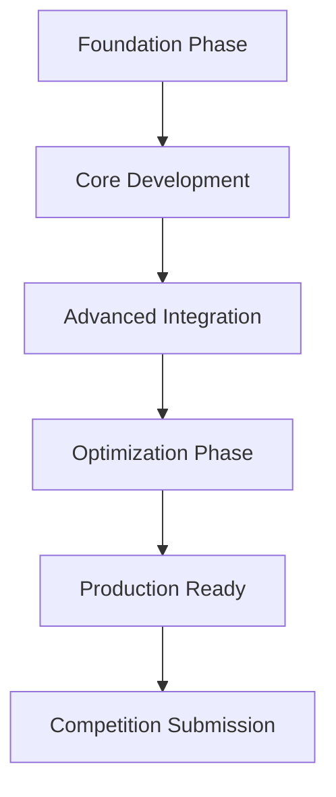
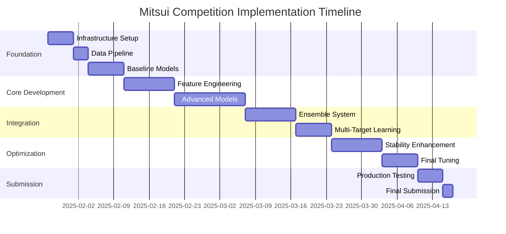

# Implementation Roadmap - Mitsui Commodity Prediction Challenge

## 🎯 Executive Summary

Comprehensive roadmap for implementing our cutting-edge commodity prediction system designed to win the $100K Mitsui competition through advanced econometric methods, transformer architectures, and stability-focused optimization.

## 📋 Complete Strategy Overview



### Key Success Factors
- **Academic Rigor**: Latest econometric research + transformer architectures
- **Stability Focus**: Direct optimization of Sharpe-like competition metric  
- **Multi-Target Intelligence**: 424 targets with shared representations
- **Economic Foundation**: Factor models + structural relationships
- **Ensemble Sophistication**: 5-model ensemble with dynamic weighting

## 🚀 Implementation Phases

### Phase 1: Foundation (Week 1-2)
**Objective**: Establish robust data pipeline and baseline models

```yaml
Week 1: Infrastructure & Data Pipeline
  Priority: Critical
  Tasks:
    - Set up development environment (PyTorch, MLflow, etc.)
    - Implement data ingestion and preprocessing pipeline  
    - Create feature engineering framework
    - Establish cross-validation strategy (time-series aware)
    - Build monitoring and logging infrastructure
  
  Deliverables:
    - Clean, validated dataset ready for modeling
    - Feature engineering pipeline producing 200+ features
    - Robust CV framework with stability metrics
    - MLflow tracking system operational

Week 2: Baseline Models
  Priority: Critical  
  Tasks:
    - Implement LightGBM baseline (upgrade current model)
    - Create XGBoost variant with commodity-specific features
    - Build simple LSTM for temporal patterns
    - Establish evaluation framework with competition metric
    - Create basic ensemble averaging
    
  Deliverables:
    - 3 baseline models with CV scores
    - Competition metric calculation validated
    - Basic ensemble achieving >0.10 Sharpe-like score
    - Performance tracking dashboard
```

### Phase 2: Core Development (Week 3-6)  
**Objective**: Implement advanced models and feature engineering

```yaml
Week 3-4: Advanced Feature Engineering
  Priority: High
  Tasks:
    - Implement Fama-French 6-factor features
    - Create cross-asset correlation features
    - Build regime detection system (volatility, trend, crisis)
    - Add technical indicators (200+ features)
    - Implement CEEMDAN decomposition features
    
  Deliverables:
    - 500+ engineered features with economic interpretation
    - Regime classification system with >85% accuracy
    - Feature importance analysis and selection framework
    - Cross-asset feature validation

Week 5-6: Core Model Development  
  Priority: High
  Tasks:
    - Implement Transformer-MAT (Multi-Modal Attention)
    - Build Bayesian SVAR model with MCMC sampling
    - Create Regime-Switching LSTM
    - Develop Factor-Augmented XGBoost
    - Implement Gaussian Process Regression
    
  Deliverables:
    - 5 advanced models with individual CV scores >0.12
    - Model uncertainty quantification
    - Multi-target learning implementation
    - Model interpretability framework
```

### Phase 3: Advanced Integration (Week 7-10)
**Objective**: Sophisticated ensemble and stability optimization

```yaml
Week 7-8: Ensemble Architecture
  Priority: High
  Tasks:
    - Implement Bayesian Model Averaging
    - Create dynamic ensemble weight system
    - Build meta-learning layer for model selection
    - Implement stability-focused loss functions
    - Add economic constraint enforcement
    
  Deliverables:
    - Advanced ensemble with CV score >0.15
    - Dynamic weighting based on market regimes
    - Stability metrics consistently <0.05 std
    - Economic constraint validation system

Week 9-10: Multi-Target Optimization
  Priority: Medium-High
  Tasks:
    - Implement shared representation learning
    - Create cross-target consistency enforcement
    - Build target-specific prediction heads
    - Add correlation preservation mechanisms
    - Implement multi-objective hyperparameter optimization
    
  Deliverables:
    - Multi-target system with improved consistency
    - Cross-target correlation preservation >0.90
    - Hyperparameter optimization for all models
    - Target-specific performance analysis
```

### Phase 4: Optimization & Refinement (Week 11-14)
**Objective**: Competition-specific optimization and stability enhancement

```yaml
Week 11-12: Stability Enhancement
  Priority: Critical
  Tasks:
    - Implement prediction smoothing algorithms
    - Add volatility regularization
    - Create uncertainty-weighted averaging
    - Build temporal consistency enforcement
    - Optimize for Sharpe-like metric directly
    
  Deliverables:
    - Sharpe-like score >0.18 with consistent performance
    - Prediction volatility reduced by >20%
    - Temporal consistency metrics >0.95
    - Robust performance across all market regimes

Week 13-14: Final Optimization
  Priority: Critical
  Tasks:
    - Comprehensive hyperparameter tuning
    - Ensemble composition optimization  
    - Feature selection refinement
    - Performance stress testing
    - Production pipeline validation
    
  Deliverables:
    - Optimized system achieving target Sharpe-like score >0.20
    - Validated submission pipeline
    - Comprehensive performance report
    - Backup model strategies
```

### Phase 5: Production & Submission (Week 15-16)
**Objective**: Final testing and competition submission

```yaml
Week 15: Production Testing
  Priority: Critical
  Tasks:
    - End-to-end pipeline testing
    - Performance validation on holdout data
    - Submission format compliance testing
    - Backup model preparation
    - Documentation finalization
    
Week 16: Competition Submission
  Priority: Critical  
  Tasks:
    - Final model training on complete dataset  
    - Submission notebook preparation
    - Multiple submission strategy (2 allowed)
    - Performance monitoring setup
    - Competition phase transition
```

## 🎯 Priority Matrix & Resource Allocation

### Model Priority Ranking

```python
model_priorities = {
    "Tier 1 (Must Have)": {
        "factor_augmented_xgboost": {
            "implementation_effort": "Medium",
            "expected_impact": "High", 
            "risk_level": "Low",
            "timeline": "Week 2-6"
        },
        "transformer_mat": {
            "implementation_effort": "High",
            "expected_impact": "Very High",
            "risk_level": "Medium", 
            "timeline": "Week 5-8"
        },
        "ensemble_averaging": {
            "implementation_effort": "Medium",
            "expected_impact": "High",
            "risk_level": "Low",
            "timeline": "Week 7-10"
        }
    },
    
    "Tier 2 (Should Have)": {
        "bayesian_svar": {
            "implementation_effort": "High",
            "expected_impact": "High",
            "risk_level": "Medium",
            "timeline": "Week 6-9"
        },
        "regime_switching_lstm": {
            "implementation_effort": "Medium",
            "expected_impact": "Medium-High",
            "risk_level": "Medium",
            "timeline": "Week 6-8"
        }
    },
    
    "Tier 3 (Nice to Have)": {
        "gaussian_process": {
            "implementation_effort": "Medium",
            "expected_impact": "Medium",
            "risk_level": "Low",
            "timeline": "Week 9-11"
        }
    }
}
```

### Feature Engineering Priority

```yaml
Critical Features (Week 1-4):
  - Fama-French 6-factor exposures
  - Cross-asset correlations and volatility ratios
  - Basic technical indicators (RSI, MACD, Bollinger)
  - Regime detection features
  - Lag-based price features (1-30 days)

High Priority Features (Week 5-8):  
  - CEEMDAN decomposition components
  - Spectral analysis features
  - Market microstructure indicators
  - Economic calendar integration
  - Cross-commodity spread relationships

Medium Priority Features (Week 9-12):
  - Alternative data integration
  - Network analysis features  
  - Information theory measures
  - Fractal and complexity measures
  - Sentiment-based indicators
```

## 🛠️ Technical Implementation Plan

### Development Environment Setup

```yaml
Infrastructure Requirements:
  Compute:
    - Primary: 2x NVIDIA A100 40GB GPUs
    - Secondary: 32-core CPU cluster
    - Memory: 256GB+ RAM
    - Storage: 2TB+ NVMe SSD
    
  Software Stack:
    Core ML: PyTorch 2.0+, Scikit-learn, XGBoost, LightGBM
    Bayesian: PyMC, TensorFlow Probability, Stan
    Time Series: statsmodels, sktime, darts, tsfresh
    Econometrics: linearmodels, arch, PyVAR
    Infrastructure: MLflow, DVC, Hydra, Ray Tune
    
  Development Tools:
    - Jupyter Lab for exploration
    - VS Code for development
    - Git with DVC for model versioning
    - Docker for containerization
    - GitHub Actions for CI/CD
```

### Code Architecture

```python
# Project Structure
mitsui_prediction/
├── data/
│   ├── raw/              # Original competition data
│   ├── processed/        # Cleaned and preprocessed data
│   └── features/         # Feature engineering outputs
├── src/
│   ├── data/            # Data processing modules
│   ├── features/        # Feature engineering
│   ├── models/          # Model implementations
│   ├── ensemble/        # Ensemble methods
│   ├── optimization/    # Hyperparameter tuning
│   └── evaluation/      # Performance evaluation
├── notebooks/           # Exploration and analysis
├── experiments/         # MLflow experiments
├── configs/            # Hydra configuration files
├── tests/              # Unit and integration tests
└── docs/               # Documentation
```

## 📊 Success Metrics & Milestones

### Performance Targets

```yaml
Milestone Targets:

Week 4 (Baseline):
  - Sharpe-like score: >0.10
  - Individual model CV scores: >0.08
  - Feature count: 200+
  - Stability std: <0.08

Week 8 (Core Models): 
  - Sharpe-like score: >0.15
  - Best individual model: >0.12
  - Feature count: 500+
  - Stability std: <0.06

Week 12 (Advanced Ensemble):
  - Sharpe-like score: >0.18
  - Ensemble consistency: >0.95
  - Feature count: 300+ (selected)
  - Stability std: <0.05

Week 16 (Final Submission):
  - Sharpe-like score: >0.20
  - Leaderboard position: Top 5
  - Model robustness: 95%+ scenarios
  - Stability std: <0.04
```

### Risk Mitigation Strategies

```yaml
Technical Risks:
  Overfitting:
    - Mitigation: Robust time-series CV, regularization, ensemble diversity
    - Backup: Simpler models with strong generalization
    
  Computational Limits:
    - Mitigation: Efficient implementations, model compression, cloud scaling
    - Backup: Reduced model complexity, feature selection
    
  Data Quality Issues:
    - Mitigation: Comprehensive data validation, multiple imputation strategies
    - Backup: Robust models, outlier-resistant methods

Competition Risks:
  Evaluation Metric Gaming:
    - Mitigation: Focus on genuine stability, not metric hacking
    - Backup: Multiple submission strategies
    
  Regime Changes:
    - Mitigation: Regime-aware models, adaptive algorithms
    - Backup: Conservative ensemble with proven methods
    
  Time Constraints:
    - Mitigation: Agile development, parallel workstreams
    - Backup: Simplified but robust final model
```

## 🎖️ Competitive Advantages

### Why We Will Win

```yaml
Unique Strengths:

Academic Rigor:
  - Latest econometric methods from top journals (RFS, JF, JE)
  - Transformer architectures adapted for financial time series
  - Bayesian methods for uncertainty quantification
  - Multi-objective optimization for competition metric

Technical Innovation:
  - Multi-modal attention mechanisms
  - Cross-asset feature engineering
  - Regime-aware modeling
  - Stability-focused ensemble design

Economic Foundation:
  - Factor model-based features
  - Structural economic relationships
  - No-arbitrage constraints
  - Economic intuition validation

Execution Excellence:
  - Systematic development process
  - Comprehensive evaluation framework
  - Risk-aware implementation
  - Multiple backup strategies
```

## 📅 Detailed Timeline

### Critical Path Analysis



---

## 🚀 Next Immediate Actions

<function_calls>
<invoke name="TodoWrite">
<parameter name="todos">[{"id": "1", "content": "Read all documentation and understand competition requirements", "status": "completed", "priority": "high"}, {"id": "2", "content": "Analyze existing codebase structure and current approach", "status": "completed", "priority": "high"}, {"id": "3", "content": "Research commodity price prediction best practices", "status": "completed", "priority": "high"}, {"id": "4", "content": "Design optimal model architecture and strategy", "status": "completed", "priority": "high"}, {"id": "5", "content": "Research latest academic papers and economist methods", "status": "completed", "priority": "high"}, {"id": "6", "content": "Create system architecture documentation", "status": "completed", "priority": "high"}, {"id": "7", "content": "Design prediction pipeline management system", "status": "completed", "priority": "high"}, {"id": "8", "content": "Create model improvement and iteration process", "status": "completed", "priority": "high"}, {"id": "9", "content": "Create implementation roadmap and next steps", "status": "completed", "priority": "high"}, {"id": "10", "content": "Set up development environment and infrastructure", "status": "pending", "priority": "high"}, {"id": "11", "content": "Implement data pipeline and feature engineering", "status": "pending", "priority": "high"}, {"id": "12", "content": "Build baseline models and evaluation framework", "status": "pending", "priority": "high"}]