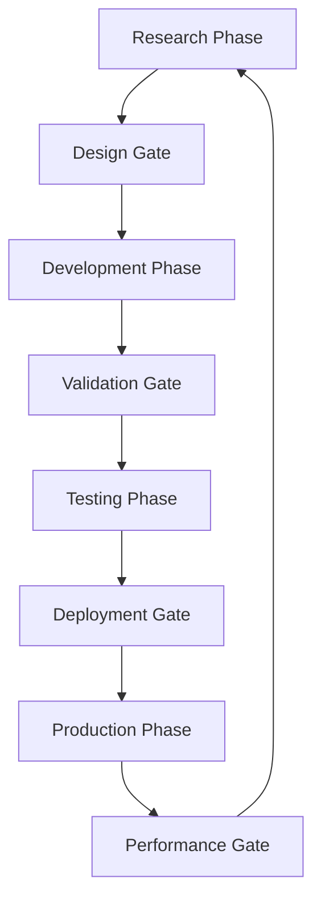

# Model Improvement & Iteration Process

## 🎯 Continuous Improvement Framework

Our systematic approach to building the winning commodity prediction model through iterative enhancement and rigorous evaluation.

## 📈 Performance Evaluation Framework

### Primary Evaluation Metrics

```python
# Competition-Specific Metrics
def evaluate_model_performance(predictions, actuals):
    """
    Comprehensive evaluation aligned with competition objectives
    """
    metrics = {
        # Primary Competition Metric
        "sharpe_like_score": calculate_sharpe_ratio(
            spearman_correlations(predictions, actuals)
        ),
        
        # Stability Metrics
        "prediction_volatility": np.std(predictions, axis=0).mean(),
        "correlation_consistency": rolling_correlation_std(predictions, actuals),
        "max_drawdown": calculate_max_drawdown(cumulative_returns),
        
        # Accuracy Metrics  
        "mean_spearman_correlation": np.mean(spearman_correlations),
        "hit_rate": calculate_directional_accuracy(predictions, actuals),
        "rmse_by_target": calculate_rmse_per_target(predictions, actuals),
        
        # Economic Metrics
        "information_ratio": calculate_information_ratio(predictions, actuals),
        "calmar_ratio": calculate_calmar_ratio(predictions, actuals),
        "sortino_ratio": calculate_sortino_ratio(predictions, actuals)
    }
    
    return metrics
```

### Multi-Dimensional Evaluation

```yaml
Evaluation Dimensions:
  Time-Based:
    - Short-term (1-30 days): Immediate prediction accuracy
    - Medium-term (1-3 months): Trend following ability  
    - Long-term (3-12 months): Structural relationship capture
    
  Target-Based:
    - Single Assets (target_0 type): Direct price prediction
    - Price Differences (target_1+ type): Spread relationship modeling
    - Lag-Based (1-4 day lags): Multi-horizon consistency
    
  Market Condition-Based:
    - Low Volatility Regime: Stability and precision
    - High Volatility Regime: Robustness and adaptability
    - Crisis Periods: Downside protection and recovery
    
  Cross-Asset:
    - Metal Commodities: Supply/demand dynamics
    - Currency Pairs: Macroeconomic relationships  
    - Stock Indices: Risk sentiment correlation
```

## 🔄 Model Iteration Methodology

### Phase-Gate Development Process



### Iteration Cycle Structure

```python
class ModelIterationCycle:
    """
    Structured 2-week iteration cycles
    """
    
    def __init__(self):
        self.cycle_duration = 14  # days
        self.phases = {
            "research": 3,      # days 1-3: Literature + data analysis
            "development": 6,   # days 4-9: Implementation + initial testing
            "validation": 3,    # days 10-12: Rigorous evaluation
            "integration": 2    # days 13-14: Ensemble integration
        }
    
    def execute_cycle(self, improvement_hypothesis):
        # Research Phase
        research_findings = self.conduct_research(improvement_hypothesis)
        
        # Development Phase  
        prototype_model = self.develop_prototype(research_findings)
        
        # Validation Phase
        validation_results = self.validate_model(prototype_model)
        
        # Integration Phase
        if validation_results.meets_criteria():
            self.integrate_to_ensemble(prototype_model)
            
        return self.generate_cycle_report()
```

## 🧪 Feature Engineering Innovation Process

### Systematic Feature Discovery

```python
# Feature Development Pipeline
class FeatureInnovationEngine:
    
    def __init__(self):
        self.feature_categories = {
            "technical_indicators": TechnicalFeatureGenerator(),
            "economic_factors": EconomicFeatureGenerator(), 
            "cross_asset_signals": CrossAssetFeatureGenerator(),
            "regime_features": RegimeFeatureGenerator(),
            "alternative_data": AlternativeDataFeatureGenerator()
        }
    
    def generate_feature_candidates(self, market_data):
        """
        Generate and evaluate new feature candidates
        """
        candidates = []
        
        # Technical Innovation
        candidates.extend(self.create_advanced_technical_features(market_data))
        
        # Economic Theory-Based
        candidates.extend(self.create_economic_theory_features(market_data))
        
        # Cross-Asset Relationships
        candidates.extend(self.create_cross_asset_features(market_data))
        
        # Regime-Dependent Features
        candidates.extend(self.create_regime_dependent_features(market_data))
        
        return self.evaluate_feature_importance(candidates)
    
    def feature_selection_process(self, features, targets):
        """
        Multi-stage feature selection optimized for competition metric
        """
        # Stage 1: Statistical Filtering
        statistical_filter = self.apply_statistical_tests(features, targets)
        
        # Stage 2: Model-Based Selection
        importance_ranking = self.calculate_feature_importance(
            statistical_filter, targets
        )
        
        # Stage 3: Stability-Based Selection  
        stability_scores = self.evaluate_feature_stability(
            importance_ranking, targets
        )
        
        # Stage 4: Economic Validation
        economically_valid = self.validate_economic_intuition(
            stability_scores
        )
        
        return economically_valid
```

### Feature Categories & Innovation Areas

```yaml
Current Feature Categories:
  
  Base Technical Features:
    - Price-based: Returns, log-returns, volatility
    - Volume-based: Volume indicators, price-volume relationships
    - Time-based: Day of week, month, seasonal patterns
    
  Advanced Technical Features:
    - Wavelets: Multi-resolution decomposition
    - Fractals: Hurst exponent, fractal dimension
    - Information Theory: Entropy, mutual information
    - Network Analysis: Correlation networks, centrality measures
    
  Economic Factor Features:
    - Macro Indicators: GDP, inflation, interest rates
    - Market Microstructure: Bid-ask spreads, order flow
    - Sentiment Indicators: VIX-like measures, news sentiment
    - Supply/Demand: Inventory levels, production capacity
    
  Cross-Asset Features:
    - Correlation Features: Rolling correlations, correlation breakdowns
    - Spread Features: Yield spreads, commodity spreads
    - Momentum Features: Cross-asset momentum, mean reversion
    - Risk Features: Beta, downside correlation
    
Research Pipeline:
  Weekly Feature Sprint:
    - Monday: Literature review for new feature ideas
    - Tuesday-Wednesday: Feature implementation & testing
    - Thursday: Feature evaluation & selection
    - Friday: Integration & performance assessment
```

## 🎛️ Hyperparameter Optimization Strategy

### Multi-Level Optimization Framework

```python
class HyperparameterOptimizer:
    """
    Competition-optimized hyperparameter search
    """
    
    def __init__(self):
        self.optimization_levels = {
            "model_level": self.optimize_individual_models,
            "ensemble_level": self.optimize_ensemble_weights,
            "system_level": self.optimize_system_parameters
        }
        
        self.search_strategies = {
            "random_search": RandomSearchCV,
            "bayesian_optimization": BayesSearchCV,
            "evolutionary": EvolutionarySearchCV,
            "multi_objective": MOEASearchCV  # For Sharpe-ratio + stability
        }
    
    def optimize_for_competition(self, model, parameter_space):
        """
        Multi-objective optimization for competition metric
        """
        # Define Competition-Specific Objective
        def competition_objective(params):
            model.set_params(**params)
            predictions = cross_val_predict(model, X_train, y_train, cv=tscv)
            
            # Primary objective: Sharpe-like score
            sharpe_score = self.calculate_sharpe_like_score(predictions, y_train)
            
            # Secondary objectives: Stability metrics
            stability_score = self.calculate_stability_score(predictions)
            
            # Multi-objective return
            return {
                'sharpe_score': sharpe_score,
                'stability_score': stability_score,
                'combined_score': 0.7 * sharpe_score + 0.3 * stability_score
            }
        
        # Run Multi-Objective Optimization
        study = optuna.create_study(
            directions=['maximize', 'maximize', 'maximize']
        )
        study.optimize(competition_objective, n_trials=200)
        
        return study.best_params
```

### Optimization Schedule

```yaml
Hyperparameter Optimization Calendar:
  
  Daily (Continuous):
    - Learning rate scheduling
    - Ensemble weight updates
    - Threshold adjustments
    
  Weekly (Focused):  
    - Individual model parameters
    - Feature selection parameters
    - Regularization strengths
    
  Bi-weekly (Comprehensive):
    - Architecture modifications
    - Ensemble composition
    - Cross-validation strategies
    
  Monthly (Strategic):
    - Algorithm selection
    - Loss function modifications
    - System-level parameters
```

## 🔬 Research & Development Workflow

### Research Prioritization Matrix

```python
# Research Priority Scoring
def calculate_research_priority(idea):
    """
    Score research ideas on multiple dimensions
    """
    scores = {
        'competition_impact': rate_competition_relevance(idea),      # 0-10
        'implementation_effort': rate_implementation_difficulty(idea), # 0-10 
        'theoretical_soundness': rate_theoretical_basis(idea),       # 0-10
        'empirical_evidence': rate_existing_evidence(idea),          # 0-10
        'timeline_feasibility': rate_timeline_fit(idea)             # 0-10
    }
    
    # Weighted priority score
    priority = (
        0.3 * scores['competition_impact'] +
        0.2 * (10 - scores['implementation_effort']) +  # Lower effort = higher priority
        0.2 * scores['theoretical_soundness'] +
        0.2 * scores['empirical_evidence'] +
        0.1 * scores['timeline_feasibility']
    )
    
    return priority, scores
```

### Research Queue Management

```yaml
Current Research Queue:

High Priority (P0):
  - Transformer attention mechanism optimization for commodity data
  - Bayesian ensemble weight learning with stability constraints
  - Multi-target loss function with correlation preservation
  
Medium Priority (P1):
  - Graph neural networks for cross-asset relationships
  - Reinforcement learning for dynamic feature selection  
  - Meta-learning for rapid adaptation to regime changes
  
Low Priority (P2):
  - Alternative data integration (satellite, news, social)
  - Quantum machine learning applications
  - Federated learning across different commodity markets

Research Methodology:
  1. Literature Review (1 day)
  2. Theoretical Validation (1 day)  
  3. Proof of Concept (2-3 days)
  4. Empirical Testing (2-3 days)
  5. Performance Evaluation (1 day)
  6. Integration Decision (1 day)
```

## 🏆 Competition-Specific Optimization

### Sharpe-Ratio Focused Improvements

```python
class CompetitionOptimizer:
    """
    Specialized optimizer for competition metric
    """
    
    def __init__(self):
        self.stability_enhancers = [
            "prediction_smoothing",
            "ensemble_diversification", 
            "volatility_regularization",
            "correlation_consistency_penalties"
        ]
        
        self.accuracy_enhancers = [
            "multi_target_learning",
            "cross_asset_feature_engineering",
            "regime_aware_modeling",
            "economic_constraint_integration"
        ]
    
    def optimize_stability(self, model_predictions):
        """
        Enhance prediction stability for better Sharpe ratio denominator
        """
        # Temporal Smoothing
        smoothed_predictions = self.apply_temporal_smoothing(model_predictions)
        
        # Cross-Target Consistency
        consistent_predictions = self.enforce_cross_target_consistency(
            smoothed_predictions
        )
        
        # Volatility Regularization
        regularized_predictions = self.apply_volatility_regularization(
            consistent_predictions
        )
        
        return regularized_predictions
    
    def optimize_accuracy(self, features, targets):
        """
        Enhance prediction accuracy for better Sharpe ratio numerator
        """
        # Multi-Target Feature Learning
        shared_features = self.learn_shared_representations(features, targets)
        
        # Cross-Asset Signal Integration
        enhanced_features = self.integrate_cross_asset_signals(shared_features)
        
        # Economic Constraint Integration
        economically_valid_features = self.apply_economic_constraints(
            enhanced_features
        )
        
        return economically_valid_features
```

### Stability Enhancement Techniques

```yaml
Stability Enhancement Toolkit:

Prediction Level:
  - Temporal smoothing with economic justification
  - Cross-target consistency enforcement
  - Uncertainty-weighted ensemble averaging
  - Regime-conditional prediction adjustments

Model Level:
  - Dropout regularization during inference
  - Model averaging across multiple initializations
  - Bayesian model uncertainty quantification
  - Robust loss functions (Huber, quantile)

System Level:  
  - Multi-model ensemble diversification
  - Feature stability monitoring and filtering
  - Dynamic model weight adjustment
  - Online learning with stability constraints
```

## 📊 Performance Tracking & Iteration History

### Iteration Tracking System

```python
class IterationTracker:
    """
    Track all model improvements and their impact
    """
    
    def __init__(self):
        self.iteration_history = []
        self.performance_database = {}
        self.feature_evolution = {}
        
    def log_iteration(self, iteration_data):
        """
        Log each iteration with comprehensive metadata
        """
        iteration_record = {
            'iteration_id': generate_iteration_id(),
            'timestamp': datetime.now(),
            'hypothesis': iteration_data['hypothesis'],
            'changes_made': iteration_data['changes'],
            'performance_metrics': iteration_data['metrics'],
            'validation_results': iteration_data['validation'],
            'stability_impact': iteration_data['stability'],
            'implementation_notes': iteration_data['notes'],
            'next_steps': iteration_data['next_steps']
        }
        
        self.iteration_history.append(iteration_record)
        self.update_performance_trends(iteration_record)
        
    def generate_improvement_report(self):
        """
        Analyze improvement trajectory and identify patterns
        """
        report = {
            'overall_progress': self.calculate_overall_progress(),
            'best_performing_changes': self.identify_best_changes(),
            'stability_trends': self.analyze_stability_trends(),
            'feature_importance_evolution': self.track_feature_evolution(),
            'recommendations': self.generate_recommendations()
        }
        
        return report
```

### Success Metrics & KPIs

```yaml
Iteration Success Criteria:

Must Have (Green Light):
  - Sharpe-like score improvement: +2% minimum
  - No stability degradation: <1% std increase
  - Cross-validation consistency: All folds improve
  - Economic intuition alignment: Pass expert review

Should Have (Amber Light):
  - Individual target improvements: 80%+ targets improve
  - Regime robustness: Performance across all market conditions  
  - Feature importance stability: Core features remain important
  - Computational efficiency: <10% increase in training time

Nice to Have (Blue Sky):
  - Interpretability improvements: Better feature attribution
  - Generalization potential: Strong out-of-sample performance
  - Research publication quality: Novel methodological contributions
  - Industry applicability: Transferable to other prediction tasks
```

## 🎯 Final Optimization Sprint

### Pre-Competition Optimization

```yaml
Final 4-Week Sprint Plan:

Week 1: Model Architecture Finalization
  - Best performing model selection
  - Ensemble composition optimization
  - Hyperparameter fine-tuning
  - Performance validation

Week 2: Stability Enhancement
  - Prediction smoothing optimization
  - Cross-target consistency improvements
  - Uncertainty quantification enhancement
  - Robustness testing

Week 3: Feature Engineering Refinement  
  - Feature selection optimization
  - Cross-asset signal enhancement
  - Economic constraint integration
  - Feature stability validation

Week 4: Final Integration & Testing
  - End-to-end pipeline testing
  - Performance stress testing
  - Submission format validation
  - Backup strategy preparation
```

---

*This systematic improvement process ensures we build not just a good model, but the winning model through rigorous iteration, comprehensive evaluation, and competition-specific optimization.*