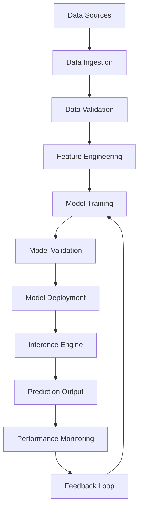

# Mitsui Prediction Machine - Pipeline Management System

## 🚀 Executive Summary
Comprehensive operational framework for managing our advanced commodity prediction system, from data ingestion to model deployment and continuous improvement.

## 📊 Pipeline Overview



## 🔄 Core Pipeline Components

### 1. Data Pipeline Management

#### Data Ingestion Engine
```yaml
Schedule: 
  - Market Data: Every 15 minutes during trading hours
  - Economic Data: Daily at market close
  - External Factors: As available

Data Sources:
  - LME prices (real-time API)
  - JPX futures (market data feed)
  - US equity data (Bloomberg/Yahoo)
  - FX rates (multiple providers)
  - Economic indicators (FRED, ECB, etc.)

Quality Checks:
  - Missing data detection
  - Outlier identification  
  - Cross-source validation
  - Temporal consistency checks
```

#### Data Preprocessing Pipeline
```python
# Pipeline Structure:
1. Raw Data Validation
   - Schema compliance
   - Data type verification
   - Range checks
   
2. Missing Data Handling
   - Forward fill for prices
   - Interpolation for indicators
   - Model-based imputation for complex patterns
   
3. Outlier Management
   - Statistical outlier detection (3-sigma rule)
   - Economic outlier validation (manual review)
   - Winsorization vs removal decisions
   
4. Feature Store Update
   - Versioned feature engineering
   - Feature lineage tracking
   - Schema evolution management
```

### 2. Training Pipeline Management

#### Training Orchestration
```yaml
Training Schedule:
  - Full Retrain: Weekly (Sunday nights)
  - Incremental Update: Daily
  - Emergency Retrain: On-demand (performance degradation)

Training Infrastructure:
  - Primary: 2x A100 GPUs for transformer models
  - Secondary: CPU cluster for Bayesian models
  - Storage: 10TB+ for model artifacts and logs

Model Training Sequence:
  1. Feature Engineering (2 hours)
  2. Base Model Training (8 hours)
     - Transformer-MAT: 3 hours
     - Bayesian SVAR: 2 hours  
     - LSTM variants: 2 hours
     - Tree models: 1 hour
  3. Ensemble Training (1 hour)
  4. Validation & Testing (1 hour)
```

#### Cross-Validation Strategy
```python
# Time-Series Cross-Validation
def time_series_cv_strategy():
    """
    Custom CV for commodity prediction with:
    - No future data leakage
    - Expanding window approach
    - Stability-focused validation
    """
    
    # Training Windows
    initial_train_size = 365 * 2  # 2 years initial
    validation_size = 90         # 3 months validation
    step_size = 30              # 1 month step
    
    # Stability Metrics
    primary_metric = "sharpe_like_score"
    stability_metrics = [
        "prediction_variance",
        "correlation_consistency", 
        "drawdown_metrics"
    ]
    
    return cv_splits, validation_strategy
```

### 3. Model Management System

#### Model Versioning & Registry
```python
# MLflow Model Registry Structure
model_registry = {
    "base_models": {
        "transformer_mat": "v2.3.1",
        "bayesian_svar": "v1.4.2", 
        "regime_lstm": "v1.8.0",
        "factor_xgboost": "v3.1.0"
    },
    "ensemble_model": "v4.2.1",
    "production_model": "v4.2.0"
}

# Model Metadata
model_metadata = {
    "training_date": "2025-01-26",
    "training_data_version": "v2.1.0",
    "hyperparameters": {...},
    "validation_scores": {...},
    "feature_importance": {...},
    "stability_stats": {...}
}
```

#### A/B Testing Framework
```yaml
Testing Strategy:
  - Champion vs Challenger approach
  - Traffic split: 70% champion, 30% challenger
  - Success criteria: 
    - 5% improvement in Sharpe-like score
    - No degradation in stability metrics
    - 95% confidence level required

Rollout Process:
  1. Shadow testing (1 week)
  2. Canary deployment (10% traffic, 1 week)  
  3. Gradual rollout (30%, 50%, 70%, 100%)
  4. Rollback triggers automatic if performance drops
```

### 4. Inference Pipeline

#### Real-Time Prediction Engine
```python
# Inference Architecture
class PredictionEngine:
    def __init__(self):
        self.feature_pipeline = FeaturePipeline()
        self.model_ensemble = EnsembleModel.load_production()
        self.post_processor = PostProcessor()
        
    def predict(self, market_data):
        # 1. Feature Engineering (< 100ms)
        features = self.feature_pipeline.transform(market_data)
        
        # 2. Ensemble Prediction (< 500ms)  
        raw_predictions = self.model_ensemble.predict(features)
        
        # 3. Post-Processing (< 50ms)
        final_predictions = self.post_processor.apply(
            raw_predictions, 
            constraints=self.economic_constraints
        )
        
        return final_predictions
```

#### Batch Prediction System
```yaml
Daily Prediction Schedule:
  - Pre-market: 6:00 AM UTC (US pre-market analysis)
  - Market Open: Various times (regional markets)
  - Post-market: 22:00 UTC (daily summary)

Output Formats:
  - Competition Format: 424 targets per date_id
  - Analysis Format: With confidence intervals, regime states
  - Monitoring Format: With feature attribution, drift metrics
```

## 📈 Performance Monitoring & Alerting

### Real-Time Monitoring Dashboard
```python
# Key Performance Indicators (KPIs)
monitoring_metrics = {
    "primary_metrics": {
        "sharpe_like_score": "target > 0.15",
        "mean_spearman_corr": "target > 0.08",
        "std_spearman_corr": "target < 0.05"
    },
    
    "system_metrics": {
        "inference_latency": "< 1000ms",
        "feature_pipeline_latency": "< 200ms", 
        "model_memory_usage": "< 16GB",
        "prediction_throughput": "> 1000 predictions/min"
    },
    
    "data_quality_metrics": {
        "missing_data_rate": "< 1%",
        "outlier_rate": "< 0.5%",
        "schema_violations": "= 0",
        "data_freshness": "< 30 minutes"
    }
}
```

### Alert System
```yaml
Alert Levels:
  Critical (PagerDuty):
    - Production model failing
    - Data pipeline completely down
    - Performance drop > 20%
    
  Warning (Slack):
    - Performance drop 5-20%
    - Data quality issues
    - Model drift detected
    
  Info (Dashboard):
    - Training completed
    - New model deployed
    - Scheduled maintenance
```

## 🔧 Operational Procedures

### Daily Operations Checklist
```markdown
## Morning Routine (9:00 AM UTC)
- [ ] Check overnight prediction performance
- [ ] Verify data pipeline health  
- [ ] Review model drift metrics
- [ ] Check ensemble component weights
- [ ] Validate market regime detection

## Mid-Day Routine (15:00 UTC)  
- [ ] Monitor real-time predictions
- [ ] Check system resource usage
- [ ] Review prediction confidence levels
- [ ] Validate cross-asset correlations

## Evening Routine (21:00 UTC)
- [ ] Daily performance summary
- [ ] Data quality report
- [ ] Model training status
- [ ] Next-day preparation
```

### Weekly Operations
```markdown
## Weekly Review (Sundays)
- [ ] Full model retraining
- [ ] Weekly performance analysis
- [ ] Feature importance review
- [ ] Hyperparameter optimization results
- [ ] Infrastructure health check
- [ ] Backup and disaster recovery test
```

## 🚨 Incident Response

### Response Procedures
```yaml
Incident Classification:
  P0 (Critical): Production predictions failing
    - Response Time: 15 minutes
    - Escalation: All hands
    - Rollback: Automatic to last known good model
    
  P1 (High): Performance degradation > 10%
    - Response Time: 1 hour
    - Escalation: On-call engineer
    - Action: Investigation and hotfix
    
  P2 (Medium): Data quality issues
    - Response Time: 4 hours  
    - Escalation: Data team
    - Action: Root cause analysis
```

### Disaster Recovery
```yaml
Backup Strategy:
  - Model artifacts: Daily backup to S3
  - Training data: Weekly backup with versioning
  - Feature store: Real-time replication
  - Code repository: Git with multiple remotes

Recovery Time Objectives:
  - Model deployment: < 30 minutes
  - Full system restore: < 2 hours
  - Historical data recovery: < 8 hours
```

## 📊 Reporting & Analytics

### Automated Reports
```python
# Daily Report Generation
daily_report = {
    "performance_summary": {
        "sharpe_like_score": calculate_daily_score(),
        "individual_target_performance": get_target_breakdown(),
        "model_attribution": analyze_ensemble_contributions()
    },
    
    "system_health": {
        "uptime": measure_system_uptime(),
        "latency_stats": calculate_latency_percentiles(),
        "resource_utilization": get_resource_metrics()
    },
    
    "market_insights": {
        "regime_detection": current_market_regime(),
        "volatility_analysis": measure_market_volatility(),
        "correlation_changes": detect_correlation_shifts()
    }
}
```

### Monthly Business Review
```markdown
## Monthly KPIs
- Cumulative competition score
- Model stability metrics
- Operational efficiency gains
- Infrastructure cost optimization
- Research & development progress
```

---

*This pipeline management system ensures reliable, scalable, and continuously improving commodity prediction capabilities optimized for the competition's unique requirements.*